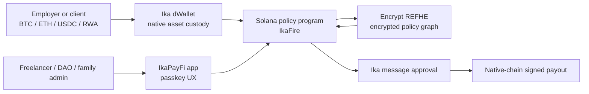
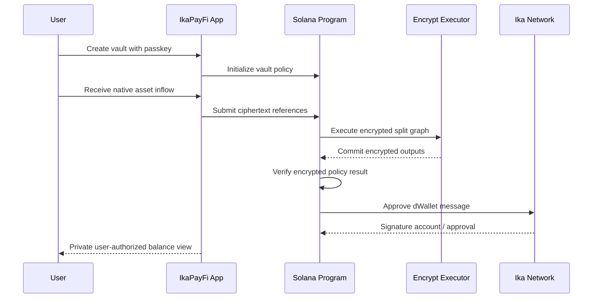

# IkaPayFi Architecture

IkaPayFi is split into a user-facing PayFi app and an underlying custody/policy engine called IkaFire.

## On-Chain Responsibilities

The Solana policy program stores vault configuration, policy metadata, signer roles, and ciphertext account references. It does not store plaintext salaries, remittance amounts, split percentages, or balances.

The program requests Encrypt graph execution for private calculations:

- apply incoming payment
- split into savings, family, bills, and spendable buckets
- enforce per-period spending limits
- decide whether a payout can be approved

If the encrypted policy result is valid, the program calls Ika approval logic so the dWallet can sign the external-chain transaction.

## Off-Chain Responsibilities

The web app is responsible for:

- passkey onboarding
- user-friendly vault setup
- building encrypted inputs
- reading/decrypting user-authorized views
- presenting explorer-safe audit trails

The current static MVP uses deterministic mock ciphertexts so the workflow is demoable before full pre-alpha deployment.

## Security Model

The hackathon MVP should clearly disclose pre-alpha limitations:

- Encrypt docs state the current pre-alpha release is for development/testing and should not be used for sensitive real data yet.
- Ika Solana pre-alpha docs state signing currently uses a mock signer rather than real distributed MPC.
- The design targets the final model: Ika 2PC-MPC custody plus Encrypt FHE execution.

## Policy Flow

